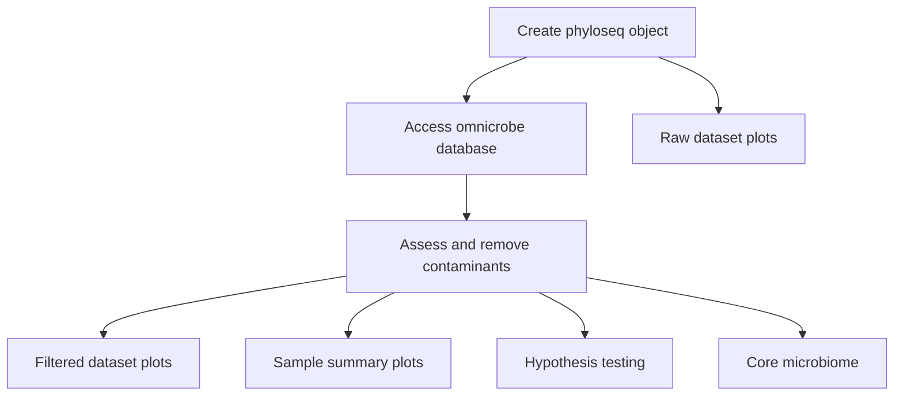

Analysis workflow for community-level analysis:


Analysis workflow for metagenomes-assembled genomes analysis:
```mermaids
flowchart TD;
    A[Prep MAG tree and metadata]-->B[Plot MAG tree]
    A-->C[Access omnicrobe database]
    A-->D[Codiversification tests]
```
