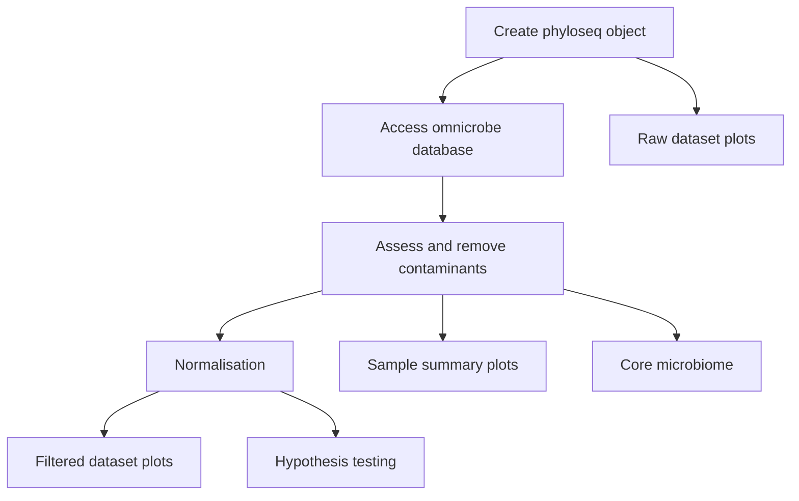
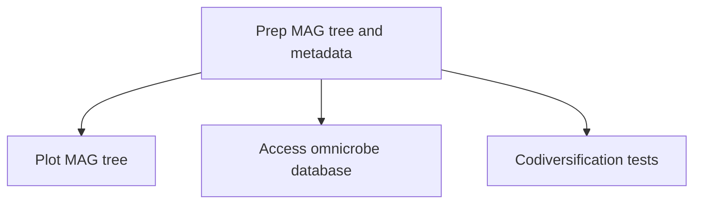

Analysis workflow for community-level analysis:

```mermaid
flowchart TD;
    A[Create phyloseq object]-->B[Access omnicrobe database];
    A-->C[Raw dataset plots];
    B-->D[Assess and remove contaminants];
    D-->E[Normalisation];
    D-->F[Sample summary plots];
    E-->G[Filtered dataset plots];
    E-->H[Hypothesis testing];
    D-->I[Core microbiome];
```

Analysis workflow for metagenomes-assembled genomes analysis:

```mermaid
flowchart TD;
    A[Prep MAG tree and metadata]-->B[Plot MAG tree]
    A-->C[Access omnicrobe database]
    A-->D[Codiversification tests]
```
